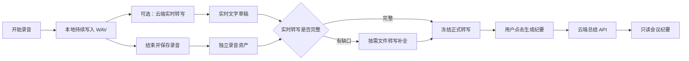
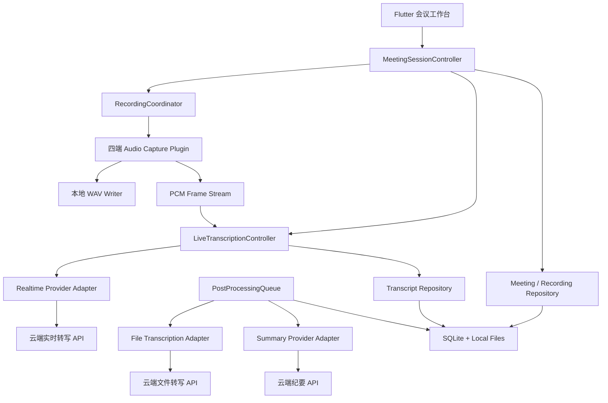
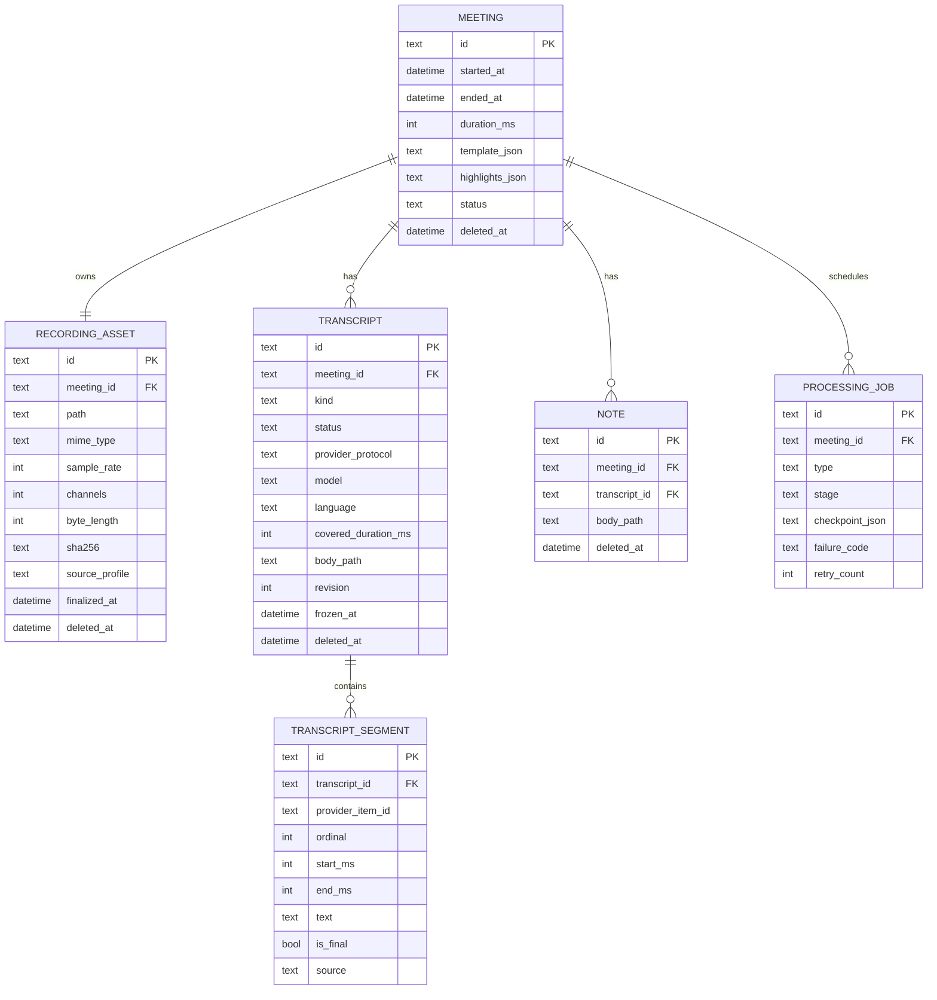

# Easy Meeting 云端实时转写与独立录音产品化重构方案

> 文档状态：已确认方向，待实施  
> 实施执行者：GPT-5.6 Luna  
> 方案基线：`agent/macos-deliverable` / `45cfc4d`  
> 编写日期：2026-08-03  
> 适用工程：Easy Meeting Flutter 四端工程

## 0. 执行摘要

当前产品的内部处理顺序虽然是“保存录音 → 转写 → 总结 → 保存纪要”，但用户只看到一个“结束并生成纪要”动作，原始录音没有成为独立、可见、可管理的产品资产。同时，当前原生音频插件只输出录音文件和音量事件，无法向云端持续发送低延迟 PCM 音频，因此不具备真正的实时转写能力。

本次重构采用以下确定方案：

1. 原始录音、实时文字、正式转写、AI 纪要是四份有关联但生命周期独立的数据。
2. 点击“结束录音”只负责安全结束并原子保存录音，不自动触发纪要生成。
3. 录音期间可选启用云端实时转写；实时服务不可用或断线时，录音必须继续。
4. 结束录音后，只有所有实时转写片段均已完成且没有音频缺口，实时结果才能晋升为正式转写；否则显示“需要补全转写”。
5. 用户在正式转写就绪后单独点击“生成会议纪要”，总结服务只读取冻结的正式转写版本。
6. 只允许一个活动录音会话；AI 后处理与下一场录音解耦。旧会议可以在后台排队补全转写或生成纪要，不再阻止下一场会议。
7. 第一实现适配 OpenAI Realtime WebSocket 协议；普通 OpenAI 兼容服务仍保留文件转写能力，但不能被假设支持实时协议。
8. API 密钥只保存在系统安全区并在运行时注入，禁止进入数据库、文件、日志、诊断包和导出内容。

核心闭环如下：



## 1. 目标、范围与非目标

### 1.1 产品目标

- 让用户始终先获得一份可靠、可播放、可恢复的原始录音。
- 在会议进行中提供低延迟云端实时文字，明确展示连接、延迟和降级状态。
- 将“转写”和“纪要生成”变成录音资产上的独立能力，允许分别执行、失败和重试。
- 保留本地优先、自带 API、无账号、无云同步的产品边界。
- 在 macOS、Windows、Android、iOS 共享同一 Dart 领域模型和处理逻辑。

### 1.2 本次范围

- 独立录音资产及录音资料库展示。
- 云端实时转写协议抽象与 OpenAI Realtime WebSocket 适配器。
- 实时文字分段、乱序归并、缺口检测和持久化。
- 文件转写作为实时转写不可用或不完整时的补全方案。
- 正式转写版本冻结和 AI 纪要手动生成。
- 三轴状态模型、任务队列、崩溃恢复、网络重连和隐私诊断。
- 桌面端会议工作台重做，并为移动端提供对应的分级导航。
- SQLite v1 → v2 显式无损迁移。

### 1.3 非目标

- 不做账号、云同步、团队协作或官方托管后端。
- 不做实时翻译、语音助手回复或会议机器人入会。
- 不做说话人分离；后续可以增加 diarization，但本轮数据模型只预留字段。
- 不提供转写正文、纪要正文或待办事项编辑。
- 不在本轮实现自动生成纪要；用户必须在正式转写就绪后主动触发。
- 不保证任意“OpenAI 兼容 API”支持实时协议；实时能力必须通过单独的能力检测确认。

## 2. 当前实现评估

### 2.1 当前代码事实

| 位置 | 当前行为 | 影响 |
|---|---|---|
| `lib/ui/recording/recording_screen.dart` | 主按钮文案为“结束并生成纪要” | 用户无法理解录音和 AI 是两个独立能力 |
| `lib/app_services/meeting_session_controller.dart` | `stopAndProcess()` 先 `recording.stop()`，随后立即 `processing.start()` | 停止录音和消耗 API 被绑定为同一命令 |
| `lib/app_services/processing_pipeline.dart` | `start()` 同时创建处理任务并执行文件转写和总结 | 无法只登记录音或只生成正式转写 |
| `lib/infrastructure/database/app_database.dart` | 只有 `notes` 与 `processing_jobs` | 没有独立会议、录音、转写和分段实体 |
| `lib/domain/models/meeting_note.dart` | 纪要直接持有 `audioPath` 和 `transcriptPath` | 纪要成为文件所有者，生命周期错误 |
| `packages/audio_capture` | Dart 只接收音量、静音和最终文件路径 | 没有可供 WebSocket 实时发送的 PCM 数据流 |
| `lib/infrastructure/network/openai_compatible_client.dart` | 只支持 REST JSON 和 multipart 文件上传 | 没有 WebSocket、会话事件和重连能力 |
| `lib/ui/settings/settings_screen.dart` | 只有“转写服务”和“总结服务”两个通用连接测试 | 无法区分实时转写与文件转写能力 |

### 2.2 交互评估

| 维度 | 当前评价 | 主要问题 | 目标 |
|---|---:|---|---|
| 任务边界清晰度 | 2/5 | 停止录音等于立即转写并总结 | 三个明确动作：结束录音、补全转写、生成纪要 |
| 数据安全感 | 2/5 | 看不到录音已保存的确定反馈 | 结束后先展示录音卡片、文件状态和播放能力 |
| 实时反馈 | 1/5 | 只有音量和时间，没有文字或云端状态 | 实时文字、连接状态、延迟和降级原因同时可见 |
| 错误恢复 | 3/5 | 已有检查点，但错误都归为处理失败 | 录音、实时转写、正式转写、总结分别失败和重试 |
| 成本可控性 | 2/5 | 结束后自动触发 API | 每次云端动作显式，显示正在使用的服务和大致音频时长 |
| 连续会议能力 | 2/5 | 上一场处理期间禁止下一场 | 录音保存后立即释放采集资源，后处理进入队列 |
| 隐私透明度 | 3/5 | 设置页说明密钥安全，但会议页未提示上传 | 首次启用实时转写时明确告知持续上传会议音频 |

### 2.3 当前设计的根因

当前的一维 `MeetingSessionPhase` 同时表达录音、实时网络和 AI 后处理。这在只有“录音后自动生成纪要”的流程中尚可工作，但加入实时转写后会出现状态组合爆炸，例如：

- 正在录音 + 实时转写正常；
- 正在录音 + 实时转写重连；
- 录音暂停 + 实时转写已暂停；
- 新会议正在录音 + 上一场正在生成纪要。

继续扩展单一枚举会产生大量互相矛盾的分支。目标实现必须改为三个正交状态轴，并由聚合控制器维护跨轴不变量。

## 3. 目标交互设计

### 3.1 信息架构

保持四个一级入口，避免移动端底部导航过载：

1. **记录**：会前准备、会议中工作台、刚结束会议的录音确认。
2. **会议库**：统一展示会议，但每条会议分别显示“录音、转写、纪要”的状态和操作。
3. **回收站**：按会议或单项资产恢复、永久删除。
4. **设置**：音频、实时转写、文件转写、总结、隐私和诊断。

原“纪要库”更名为“会议库”。这是统一检索入口，不代表重新合并资产生命周期。每个会议详情内有三个只读页签：`录音 / 转写 / 纪要`。

### 3.2 会前准备态

页面必须展示：

- 当前纪要模板；模板在开始录音后冻结为快照。
- 系统声音和麦克风能力、授权及当前输入设备状态。
- “会议中显示实时文字”开关。
- 实时转写服务状态：可用、未配置、不兼容或上次测试失败。
- 云端隐私说明：“开启后，会议音频片段会在录音过程中持续发送给你配置的服务商。”
- 主按钮“开始录音”。即使实时转写未配置或不可用，只要本地录音能力可用，按钮仍可用。

首次开启实时转写需要一次明确确认；确认结果仅表示用户理解上传行为，不代表录音权限。

### 3.3 会议进行态

桌面端采用左右分栏：

```text
┌──────────────────────────────────────────────────────────────────┐
│  正在录音  00:18:32       实时转写：已连接 · 延迟 1.2 秒          │
├──────────────────────┬───────────────────────────────────────────┤
│ 系统声音  ███████    │ 实时文字                                  │
│ 麦克风    █████      │                                           │
│                      │ 10:32  我们先确认本周的交付范围……          │
│ [标记重点]           │ 10:33  Windows 版本需要补一轮……           │
│                      │                                           │
│ [暂停] [结束录音]    │ 当前片段：然后移动端安排在……              │
└──────────────────────┴───────────────────────────────────────────┘
```

交互规则：

- “暂停”同时暂停写入录音文件和实时音频发送；恢复后创建新的连续时间段。
- “结束录音”只结束并保存录音。不得使用“结束并生成纪要”文案。
- 实时文字区自动跟随最新内容；用户主动向上滚动后停止自动滚动，并显示“回到最新”。
- 增量文字使用较弱颜色；收到完成事件后变为正式片段样式。
- 断线时顶部状态改为“实时转写已中断，录音仍在继续”，并展示重新连接进度。
- 不弹出阻断式对话框打断会议。除录音本身失败外，所有实时服务错误使用非阻断提示。
- 重点标记绑定本地录音时间轴，不依赖实时转写片段。

### 3.4 结束录音态

停止成功后，必须先出现确定反馈：

```text
录音已安全保存
38:21 · 系统声音 + 麦克风 · 43.8 MB
[播放] [在文件夹中显示]

转写状态：
- 实时转写完整：正式转写已就绪
- 存在缺口：有 02:14 音频需要补全
- 未开启实时转写：尚未生成转写

[补全/生成正式转写]  [生成会议纪要]  [开始下一场会议]
```

按钮规则：

- 正式转写未就绪时，“生成会议纪要”禁用并解释原因。
- 实时转写完整时，无需再次上传整个录音；将所有已完成片段冻结成正式转写版本。
- 存在缺口时，主操作是“补全转写”；实现可以上传缺口对应的音频区间。如果平台切片不支持精确区间，则回退为分片文件转写并合并。
- 未开启实时转写时，主操作是“生成正式转写”。
- “开始下一场会议”在录音资产和数据库记录原子保存后立即可用，不等待任何 AI 任务。
- “生成会议纪要”是显式用户动作。本轮不增加默认自动总结开关。

### 3.5 会议库

会议列表每项显示：

- 日期、时长和录音来源；
- 录音状态：可播放、缺失或损坏；
- 转写状态：未生成、实时草稿、待补全、处理中、已完成或失败；
- 纪要状态：未生成、处理中、已完成或失败。

会议详情：

- **录音**：播放器、时长、来源能力、文件大小、导出和删除。
- **转写**：只读正文、完成度、语言、生成方式、重试或重新转写。
- **纪要**：保留当前只读分区、待办、图文和 Markdown 导出。

删除规则：

- 删除纪要只软删除纪要，不删除转写和录音。
- 删除转写只软删除转写，不删除录音；若纪要仍存在，需提示纪要不会同步变化。
- 删除录音必须二次确认；默认不级联删除转写和纪要，但失去重新转写能力。
- 删除整场会议才会把全部资产一并移入 30 天回收站。

### 3.6 移动端差异

- 会议中使用顶部状态栏 + 实时文字主体 + 底部固定控制条。
- Android 的系统声音授权拒绝后降级为仅麦克风，并持续显示来源标签。
- iOS 明确显示“仅麦克风”；不暗示能够采集其他应用系统声音。
- 应用进入后台时继续本地录音；实时转写若被系统挂起，记录缺口并在返回应用后提示会后补全。

### 3.7 文案基线

| 场景 | 文案 |
|---|---|
| 停止主按钮 | 结束录音 |
| 停止成功 | 录音已安全保存 |
| 实时连接中 | 正在连接实时转写… |
| 实时正常 | 实时转写已连接 |
| 实时断线 | 实时转写已中断，录音仍在继续 |
| 实时不可用 | 当前服务不支持实时转写，将只保存录音 |
| 正式转写未生成 | 尚未生成正式转写 |
| 实时结果完整 | 正式转写已就绪 |
| 有音频缺口 | 转写存在缺口，需要补全 |
| 总结按钮 | 生成会议纪要 |

## 4. 技术方案选型评估

### 4.1 实时转写链路

| 方案 | 延迟 | 对本地录音影响 | 供应商兼容 | 隐私/成本 | 结论 |
|---|---:|---:|---:|---:|---|
| 云端 Realtime WebSocket | 低 | 可完全解耦 | 需要专用协议适配器 | 持续上传、按时长计费 | **采用**，作为真正实时能力 |
| 每 5–10 秒切文件调用 REST | 中高，且文字跳变 | 频繁切片和上传容易争用 IO | 普通兼容 API 较多 | 请求多、上下文割裂 | 不作为实时实现，只能作为降级补全 |
| 本地 Whisper | 取决于设备 | CPU/GPU 压力可能影响录音 | 不依赖云供应商 | 隐私好、包体和耗电高 | 本轮不做，可作为未来适配器 |
| 自建服务端中转 | 低 | 客户端容易控制 | 服务端可统一供应商 | 引入账号、运维和音频托管 | 与“用户自带 API、无官方后端”边界冲突 |

选择云端 WebSocket 的原因是它能提供真正的增量文字，并且网络消费者可以与本地录音线程彻底隔离。不得用滚动 REST 切片伪装为实时转写；这种方案会产生不稳定延迟、重复文字和大量上下文边界问题。

### 4.2 客户端直连与后端代理

本产品继续采用客户端直连用户配置的 API：

- 桌面/移动应用从系统安全存储读取密钥，仅在建立 TLS 连接时注入。
- 不建设官方代理，因此不新增账号、云端录音存储和服务端成本。
- 代价是客户端需要分别适配供应商协议，且移动端包内无法隐藏用户自己的密钥；这与“用户自带密钥”的产品设定一致。

如果未来改为官方付费模型服务，必须另立项目重新评估账号、额度、审计、数据保留、合规和后端密钥隔离，不能在本方案上悄悄增加中转服务。

### 4.3 数据模型

| 方案 | 优点 | 缺点 | 结论 |
|---|---|---|---|
| 继续让 `MeetingNote` 拥有音频和转写路径 | 改动少 | 删除和失败语义错误，无法表达“只有录音” | 淘汰 |
| 分别建立录音库、转写库、纪要库且没有会议根对象 | 资产独立 | 用户和代码难以判断三份数据属于哪场会议 | 不采用 |
| `MeetingRecord` 聚合 + 独立资产表 | 既有统一会议入口，又有独立生命周期 | 需要数据库迁移 | **采用** |

### 4.4 状态模型

| 方案 | 复杂度 | 并发表达 | 可测试性 | 结论 |
|---|---:|---:|---:|---|
| 扩充单一 `MeetingSessionPhase` | 初期低，后期指数增长 | 无法自然表达多轴并发 | 分支组合难覆盖 | 淘汰 |
| 完全独立的三个控制器，无聚合约束 | 中 | 强 | 容易出现跨轴非法状态 | 不采用 |
| 三轴状态 + 聚合控制器维护不变量 | 中 | 强 | 每条轴和跨轴规则可分别测试 | **采用** |

### 4.5 正式转写策略

| 方案 | 准确性 | 额外费用 | 处理时间 | 结论 |
|---|---:|---:|---:|---|
| 每场结束后固定整场重转写 | 高且一致 | 最高，相当于实时后再付一次 | 长 | 不作为默认，可手动“重新转写” |
| 无条件把屏幕实时文字当正式正文 | 网络正常时可用 | 最低 | 最快 | 无法处理断线和未完成轮次，不采用 |
| 完整实时片段直接冻结，有缺口才补全 | 高，且费用可控 | 只为缺口或失败付额外费用 | 通常最快 | **采用** |

当缺口局部合并无法做到确定性时，系统必须回退整场文件转写。产品应把这次额外云端处理展示给用户，不能为了省费用生成可能缺字或乱序的正式正文。

### 4.6 总体组件架构



## 5. 目标领域模型与数据设计

### 5.1 聚合关系



### 5.2 新增领域对象

#### `MeetingRecord`

会议的根对象，只保存时间、模板快照、重点时间点、状态和资产引用。它不内嵌正文，也不持有密钥。

```dart
enum MeetingStatus { recording, recorded, archived, trashed }

class MeetingRecord {
  String id;
  DateTime startedAt;
  DateTime? endedAt;
  Duration duration;
  NoteTemplate templateSnapshot;
  List<Duration> highlights;
  MeetingStatus status;
  DateTime? deletedAt;
}
```

#### `RecordingAsset`

录音文件的唯一所有者。最终 WAV 从临时目录移动到：

```text
ApplicationSupport/EasyMeeting/Meetings/<meetingId>/recording/audio.wav
```

保存格式、采样率、声道、字节数、SHA-256、来源能力和最终写入时间。SHA-256 用于启动恢复时检查文件与数据库是否一致，不用于上传日志。

#### `TranscriptDocument`

`kind`：

- `realtimeDraft`：会议中的增量结果，可变化；
- `finalTranscript`：冻结版本，是总结任务的唯一输入。

`status`：

- `collecting`、`needsRepair`、`processing`、`ready`、`failed`、`trashed`。

#### `TranscriptSegment`

每个完成的语音轮次保存为独立片段。至少包含本地稳定 ID、提供方 `item_id`、顺序号、开始/结束时间、文字、是否完成、来源和更新时间。

`source`：`realtime`、`batchRepair`、`batchFull`。

增量 delta 只保存在内存；完成事件立即写入数据库。为崩溃时降低损失，可每 2 秒把当前未完成 delta 写入一个本地草稿快照文件，但不得为每个字符执行数据库写入。

#### `ProcessingJob`

增加 `type`：

- `transcriptRepair`
- `transcriptFull`
- `noteSummary`

处理阶段不再把转写和总结固定串为一条不可拆分流水线。每个任务引用 `meetingId` 和输入资产版本，并保存独立检查点。

### 5.3 数据库 v2

`AppDatabase.schemaVersion` 从 1 升至 2，新增：

- `meetings`
- `recording_assets`
- `transcripts`
- `transcript_segments`

修改：

- `notes` 增加 `meeting_id`、`transcript_id`；旧 `audio_path`、`transcript_path` 在 v2 迁移后保留一版兼容读取，v3 再删除。
- `processing_jobs` 增加 `meeting_id`、`job_type`、`checkpoint_json`。

必须使用 drift 显式迁移：

1. 在同一事务中创建新表和索引。
2. 对每条旧 `notes` 创建一个 `meetings` 记录。
3. 从旧 `audio_path` 创建 `recording_assets`，不得移动或重写原文件。
4. 从旧 `transcript_path` 创建一个 `finalTranscript/ready` 记录。
5. 回填旧 `notes.meeting_id` 和 `notes.transcript_id`。
6. 对旧 `processing_jobs` 创建对应会议并转换任务类型；不能识别的任务标记为失败，错误码 `migration_review_required`，保留文件。
7. 迁移完成后运行引用和文件存在性检查；任何失败必须回滚数据库事务。

### 5.4 文件布局与原子性

```text
EasyMeeting/
  easy_meeting.sqlite
  Meetings/
    <meetingId>/
      recording/
        audio.wav
        audio.wav.meta.json
      transcripts/
        realtime-draft.jsonl
        final-r<revision>.txt
      notes/
        <noteId>.json
      jobs/
        <jobId>/
          slices/
          checkpoint.json
```

写入顺序：

1. 录音原生层关闭流并修正 WAV header。
2. Dart 层校验文件非空、WAV header 与预计帧数。
3. 复制到同目录 `.tmp`，`flush` 后原子 rename 为 `audio.wav`。
4. 计算元数据与 SHA-256。
5. 最后写入数据库资产记录。
6. 数据库提交成功后才删除原生临时文件。

数据库写入失败时保留临时录音，并在下次启动扫描 `EasyMeetingRecordings` 做孤儿录音恢复，不允许静默删除。

## 6. 状态机与并发模型

### 6.1 三轴状态

#### 录音轴 `CapturePhase`

```dart
enum CapturePhase {
  idle,
  starting,
  recording,
  pausing,
  paused,
  resuming,
  stopping,
  finalizingFile,
  recorded,
  failed,
}
```

#### 实时转写轴 `LiveTranscriptPhase`

```dart
enum LiveTranscriptPhase {
  disabled,
  connecting,
  streaming,
  reconnecting,
  degraded,
  closing,
  completed,
  failed,
}
```

#### 会后处理轴 `PostProcessingPhase`

```dart
enum PostProcessingPhase {
  idle,
  queued,
  transcribing,
  freezingTranscript,
  readyToSummarize,
  summarizing,
  persisting,
  completed,
  failed,
}
```

### 6.2 不变量

1. 同一时刻最多存在一个 `starting/recording/paused/stopping/finalizingFile` 录音会话。
2. 开始录音前先创建并持久化 `MeetingRecord(status: recording)`。
3. 录音文件未原子归档前，不能把会议标记为 `recorded`。
4. 实时转写的启动、重连、失败不得调用 `AudioCaptureService.stop()`。
5. 暂停录音后不得继续发送 PCM；恢复时必须从新的本地帧序号继续。
6. 只有最终完成事件可以成为 `TranscriptSegment.isFinal == true`。
7. 不得按网络完成事件到达顺序拼接正文；必须使用本地时间轴、`item_id` 和稳定 ordinal 排序。
8. 纪要任务只读取 `finalTranscript` 的固定 revision；转写内容变化后必须创建新 revision，不覆盖正在总结的输入。
9. 录音资产保存后，用户可以开始下一场录音，即使旧会议正在后处理。
10. 后处理队列默认串行执行，避免同一 API 配置下出现不可控并发和费用；录音实时流不占用此队列锁。

### 6.3 命令互斥

保留同步抢锁原则：任何异步命令在第一次 `await` 前必须设置操作锁和过渡态。录音控制器仍严格互斥，但移除“所有后处理期间禁止新会议”的全局锁。

```dart
abstract interface class MeetingSessionController {
  MeetingSessionState get state;

  Future<void> startMeeting(MeetingStartOptions options);
  Future<void> pauseRecording();
  Future<void> resumeRecording();
  Future<RecordingAsset> stopRecording();
  Future<void> markHighlight();
}
```

AI 操作放入独立服务：

```dart
abstract interface class MeetingProcessingService {
  Future<String> enqueueTranscript(String meetingId);
  Future<String> enqueueSummary(String meetingId, String transcriptId);
  Future<void> retry(String jobId);
  Future<void> cancelQueued(String jobId);
}
```

## 7. 原生音频与实时 PCM 管线

### 7.1 当前差距

当前 `AudioCapturePlatform` 只有：

```text
start / pause / resume / stop / permissionStatus / events
```

`events` 只发送音量和静音状态。实时转写需要在录音同时得到统一混音后的 PCM 帧，因此必须扩展插件接口，不能从正在写入的 WAV 文件末尾轮询读取。

### 7.2 规范化音频格式

新实现使用一份规范化混音流同时驱动本地文件与实时发送：

- PCM signed 16-bit little-endian；
- mono；
- 24,000 Hz；
- 每帧 200 ms，约 9,600 bytes；
- WAV 文件使用相同 PCM 参数。

OpenAI 官方实时转写示例使用 24 kHz PCM，并通过 WebSocket 追加 Base64 编码的 PCM 数据。模型或提供方如果要求其他格式，由实时适配器声明目标格式，不能在 UI 层写死。

### 7.3 插件公开接口

```dart
class AudioFrame {
  const AudioFrame({
    required this.sessionId,
    required this.sequence,
    required this.startSample,
    required this.sampleRate,
    required this.channels,
    required this.bytes,
  });

  final String sessionId;
  final int sequence;
  final int startSample;
  final int sampleRate;
  final int channels;
  final Uint8List bytes;
}

abstract class AudioCapturePlatform {
  Stream<AudioCaptureEvent> get events;
  Stream<AudioFrame> get pcmFrames;
  Future<AudioCaptureStartResult> start(AudioCaptureOptions options);
  Future<void> pause();
  Future<void> resume();
  Future<NativeRecordingResult> stop();
  Future<void> discardOrphan(String nativeSessionId);
}
```

新增独立二进制事件通道 `audio_capture/pcm`。使用 `StandardMessageCodec` 的 `Uint8List`，不要把 PCM 转成 JSON 数组。控制和音量事件继续使用现有事件通道。

### 7.4 实时线程安全与背压

- 音频回调线程只做必要的复制、混音和写入无锁/低锁环形缓冲区，不执行 Flutter channel 调用或网络操作。
- 独立串行发送队列每 200 ms 取一帧推送到 Dart。
- 本地 WAV 写入优先级高于实时推送。
- PCM 推送队列最大缓存 5 秒。超过上限时丢弃最旧的“网络副本”，记录缺口区间，但绝不丢弃本地文件帧。
- 每帧有单调 `sequence` 和 `startSample`；Dart 检测序号跳变并写入 `TranscriptGap`。
- 暂停时停止本地文件和 PCM 推送，保留累计有效录音时间；恢复后 sequence 继续递增。
- 原生层停止时先停采集，再排空本地文件写入队列并修正 header，最后返回文件路径和真实帧数。

### 7.5 平台实现

#### macOS

- 在现有 Core Audio Process Tap + `AVAudioEngine` 混音输出处产生规范化 PCM。
- macOS 14.4+ 使用系统声音 + 麦克风；旧系统和权限降级保持仅麦克风。
- 不从 `AVAudioEngine` 实时回调直接发 Flutter 事件。

#### Windows

- 在 WASAPI loopback 与 microphone 混音后的 writer 队列生成同一 PCM 帧。
- 保持 COM 音频线程非阻塞；Flutter 发送使用单独线程。

#### Android

- 在 `AudioPlaybackCapture` 与 `AudioRecord` 混音后生成 PCM 帧。
- 前台服务继续拥有录音生命周期；Flutter UI 暂时断开时本地录音不得停止。

#### iOS

- 只发送 `AVAudioSession` 麦克风 PCM。
- 后台挂起导致实时网络中断时标记缺口，录音能力按系统后台音频权限继续。

## 8. 云端实时转写技术方案

### 8.1 能力分层

转写配置拆为两个明确能力：

```dart
class TranscriptionSettings {
  FileTranscriptionConfig batch;
  RealtimeTranscriptionConfig realtime;
  bool realtimeEnabled;
}

class RealtimeTranscriptionConfig {
  Uri websocketUrl;
  String model;
  RealtimeProtocol protocol;
  SecretReference secret;
  List<String> languages;
  List<String> keywords;
  String? contextPrompt;
}

enum RealtimeProtocol { openAiRealtime, disabled }
```

`websocketUrl` 必须独立配置，不得从 REST `baseUrl` 静默猜测。可以提供“从官方 OpenAI 地址填充”的便捷按钮，但最终保存的是明确配置。

### 8.2 OpenAI Realtime 适配器

官方实时转写流程为：创建 `type: transcription` 会话，使用 WebSocket 发送 PCM，通过 `input_audio_buffer.append` 追加音频，按配置使用 VAD 或显式 `input_audio_buffer.commit` 完成语音轮次；服务返回增量和完成事件。官方同时明确不同语音轮次的完成事件不保证按顺序到达，因此必须以 `item_id` 归并，而不是直接按收到顺序拼接。

适配器职责：

```dart
abstract interface class RealtimeTranscriptionClient {
  Stream<RealtimeTranscriptEvent> get events;
  RealtimeConnectionState get connectionState;

  Future<void> connect(RealtimeTranscriptionConfig config);
  Future<void> append(AudioFrame frame);
  Future<void> commitTurn();
  Future<void> flushAndClose();
  Future<void> abort();
}
```

事件类型：

```dart
sealed class RealtimeTranscriptEvent {}

class TranscriptDelta extends RealtimeTranscriptEvent {
  String itemId;
  int contentIndex;
  String delta;
}

class TranscriptCompleted extends RealtimeTranscriptEvent {
  String itemId;
  int contentIndex;
  String transcript;
}

class TranscriptConnectionChanged extends RealtimeTranscriptEvent {}
class TranscriptGapDetected extends RealtimeTranscriptEvent {}
class TranscriptServiceError extends RealtimeTranscriptEvent {}
```

实现约束：

- 使用 `web_socket_channel` 或功能等价、四端可用且持续维护的 WebSocket 库。
- 鉴权 header 只在建立连接时从安全存储注入，不写进配置对象的可序列化部分。
- 生产配置要求 `wss://`；仅 `localhost` 测试服务允许 `ws://`。
- 初始连接超时 10 秒；心跳和服务端错误必须映射为用户安全错误码。
- 增量 delta 在内存中按 `(itemId, contentIndex)` 聚合。
- 完成事件立即覆盖相应草稿并持久化最终片段。
- 服务完成事件可能乱序，最终正文按本地音频时间轴排序。
- 会议场景优先使用服务端 VAD；VAD 配置必须位于适配器内，领域层只接收“轮次已完成”。
- 中文默认语言提示可使用 `zh-cn`，但必须允许用户选择自动或多语言。
- `prompt`、`keywords` 和语言提示来自会议模板快照与设置；关键字必须在发送前做长度和非法换行校验。
- 模型名由配置提供，不在业务逻辑中硬编码。官方当前文档的推荐模型和字段可能更新，实现时以实时官方文档和提供方能力测试为准。

### 8.3 实时连接与重连

连接策略：

1. 录音本地层成功启动后再连接实时服务；实时连接失败不回滚录音。
2. 断线后指数退避：1、2、4、8、16、30 秒，加入 0–20% 抖动。
3. 断线期间继续写本地 WAV，并记录未发送音频区间。
4. 不向新会话盲目重放已经发送但未确认的历史 PCM，避免重复文字。
5. 重连成功只发送当前之后的新帧；历史缺口留给会后文件转写补全。
6. 连续失败 5 分钟后进入 `degraded`，停止自动重连，但用户可手动重试；录音继续。

### 8.4 能力测试

设置页拆为：

- “测试实时转写”：建立 WebSocket，等待会话创建/更新确认，不发送会议音频，然后关闭。
- “测试文件转写”：使用应用内置的 1 秒无隐私测试音频，或只做 endpoint/model 能力查询；不得上传用户录音。
- “测试纪要生成”：发送固定测试文本并验证结构化 JSON。

仅调用 `/models` 不能证明实时协议兼容。能力测试结果需要保存协议版本、测试时间和错误类型，但不保存密钥或完整 URL 查询参数。

## 9. 正式转写与纪要生成

### 9.1 正式转写冻结规则

结束录音时执行：

1. 停止新 PCM 输入。
2. 要求实时适配器提交剩余音频轮次。
3. 最多等待 8 秒接收完成事件；等待不阻塞本地录音文件落盘。
4. 计算 `coveredDuration / recordingDuration`，并检查帧序号、重连缺口和未完成 item。
5. 所有片段完成且无已知缺口时，将排序后的实时片段写为 `final-r1.txt`，状态 `ready`。
6. 有缺口时保留 `realtimeDraft`，正式转写状态设为 `needsRepair`。

不能用“文字看起来完整”代替音频覆盖检查。

### 9.2 文件转写补全

文件转写继续使用 `/audio/transcriptions` 风格的 multipart 接口。官方当前文件转写文档说明单文件上限为 25 MB，因此切片必须按字节大小控制，而不是只按固定时长控制。

目标切片规则：

- 默认最大 20 MiB，给 multipart 和格式差异留余量；
- WAV 切片必须保持 header 正确、frame aligned、顺序稳定；
- 保存 `sliceIndex/startSample/endSample/hash/status` 检查点；
- 重试只发送失败或缺失切片；
- 响应按 slice index 合并，不按请求完成顺序合并；
- 若只补缺口，切片前后各增加短上下文重叠，并在合并时做确定性去重；
- 无法可靠局部合并时，回退到整场分片重转写，不能生成猜测性正文。

### 9.3 总结任务

总结任务输入固定为：

- `meetingId`
- `finalTranscriptId`
- `transcriptRevision`
- 模板快照
- 重点时间点
- 图文模式

总结仍可使用当前 OpenAI 兼容 `chat/completions` JSON 输出协议，以保持供应商兼容性。若后续引入其他总结协议，应通过 `SummaryProvider` 适配，不改领域层。

总结开始前必须再次验证 transcript revision 未被替换；总结过程中转写发生新修订时，本次任务继续使用冻结版本，并在结果中记录输入 revision。

### 9.4 后处理任务阶段

```dart
enum JobType { transcriptRepair, transcriptFull, noteSummary }

enum JobStage {
  queued,
  preparing,
  uploading,
  processing,
  persisting,
  done,
  failed,
  cancelled,
}
```

任务失败只改变对应资产状态：

- 转写任务失败：录音仍可播放，纪要按钮保持禁用。
- 总结任务失败：正式转写仍可查看，允许重试总结。
- 诊断写入失败：不回滚已经持久化的录音、转写或纪要。

## 10. 仓储公开接口

```dart
abstract interface class MeetingRepository {
  Future<MeetingRecord> create(MeetingDraft draft);
  Future<void> markRecorded(String id, RecordingAsset asset);
  Future<List<MeetingRecord>> list({String query = ''});
  Future<MeetingRecord?> load(String id);
  Future<void> moveToTrash(String id);
  Future<void> restore(String id);
  Future<void> permanentlyDelete(String id);
}

abstract interface class RecordingRepository {
  Future<RecordingAsset> importNativeResult(
    String meetingId,
    NativeRecordingResult result,
  );
  Future<RecordingAsset?> loadForMeeting(String meetingId);
  Future<List<OrphanRecording>> scanOrphans();
  Future<void> moveToTrash(String id);
}

abstract interface class TranscriptRepository {
  Future<TranscriptDocument> createRealtimeDraft(String meetingId);
  Future<void> upsertDeltaSnapshot(TranscriptDeltaSnapshot snapshot);
  Future<void> saveCompletedSegment(TranscriptSegment segment);
  Future<TranscriptDocument> freeze(
    String draftId, {
    required int revision,
  });
  Future<void> markNeedsRepair(String id, List<TranscriptGap> gaps);
  Future<TranscriptDocument?> finalForMeeting(String meetingId);
}

abstract interface class ProcessingJobRepository {
  Future<void> enqueue(ProcessingJob job);
  Future<ProcessingJob?> claimNext();
  Future<void> saveCheckpoint(ProcessingJob job);
  Future<List<ProcessingJob>> recoverable();
  Future<void> complete(String id);
  Future<void> fail(String id, SafeFailure failure);
}
```

所有仓储写操作必须满足“文件先安全落盘，数据库后引用”的原则。任何 API key 不得出现在接口参数中的可持久化模型里，统一使用 `SecretReference` 在网络边界解析。

## 11. 设置、隐私与安全

### 11.1 设置结构

设置页分为：

1. 音频来源与权限。
2. 实时转写服务：开关、WebSocket URL、模型、语言、上下文、测试。
3. 文件转写服务：REST URL、模型、测试。
4. 纪要总结服务：REST URL、模型、测试。
5. 纪要样式和主题。
6. 隐私、诊断和数据清理。

实时转写、文件转写和总结可以复用同一安全存储密钥，但配置对象只保存安全存储引用，不能复制明文密钥到 SharedPreferences。

### 11.2 隐私要求

- 实时转写默认关闭；用户完成配置并确认上传提示后才开启。
- 会议页持续显示“实时转写已开启”的云端标识。
- 日志和诊断只允许：阶段、耗时、帧数、缺口时长、重连次数、错误码、平台、版本和协议类型。
- 禁止记录：PCM、录音路径的用户目录部分、转写文本、纪要文本、API key、Authorization header、完整 URL 查询参数和响应正文。
- 错误对象进入日志前必须经过 allowlist 映射，不能直接记录 `DioException` 或 WebSocket 原始 payload。
- 诊断包导出前运行自动敏感字段扫描。
- Markdown 和录音导出均是用户主动操作；诊断包不能包含它们。

### 11.3 威胁与防护

| 风险 | 防护 |
|---|---|
| WebSocket URL 携带密钥 | 禁止 query token；只允许安全 header 注入 |
| 服务错误回显密钥或正文 | 原始错误只驻留内存，转换为安全错误码 |
| 日志记录实时事件 payload | 诊断层只接受强类型白名单事件 |
| 中间人读取会议音频 | 生产只允许 TLS；证书错误不得绕过 |
| 重连重复发送音频 | 新连接不盲目回放历史帧，缺口会后补全 |
| 数据库引用未完成文件 | 文件 flush + rename 完成后再提交数据库 |
| 删除纪要误删录音 | 独立外键与独立软删除字段，不做隐式级联 |

## 12. 可靠性、恢复与后台行为

### 12.1 启动恢复

启动顺序：

1. 打开数据库并执行迁移。
2. 扫描未完成录音会话和原生临时录音。
3. 修复可恢复 WAV header，展示“发现未保存录音”，由用户确认归档。
4. 加载 `queued/processing/failed` 后处理任务。
5. 将崩溃时处于 `uploading/processing` 的任务回退到最近持久化检查点。
6. 后处理队列恢复后，录音入口仍可用；队列恢复不得占用录音锁。

### 12.2 退出行为

- 活动录音、停止和文件归档期间禁止直接退出；窗口关闭仅隐藏。
- 实时转写失败或重连不单独阻止退出，因为录音轴已经决定是否安全。
- 后处理任务允许退出：先保存检查点并停止领取新任务，再正常关闭。
- macOS/Windows 托盘显示当前录音状态，并可显示后台任务数量。

### 12.3 后处理队列

- 同一时间默认执行一个后处理任务。
- 优先级：用户当前打开会议的显式操作 > 恢复任务 > 普通队列。
- 同一会议不得并发执行两个转写任务或两个总结任务。
- 总结任务依赖正式转写任务；依赖未完成时保持 queued，不轮询占用 CPU。
- 429 使用服务端 `Retry-After`；无该值时指数退避。
- 鉴权错误不自动无限重试，等待用户更新配置。

## 13. 代码改造清单

### 13.1 新增文件建议

```text
lib/domain/models/meeting_record.dart
lib/domain/models/recording_asset.dart
lib/domain/models/transcript_document.dart
lib/domain/models/transcript_segment.dart
lib/domain/realtime/realtime_transcription_client.dart
lib/domain/realtime/realtime_transcription_events.dart
lib/infrastructure/network/openai_realtime_transcription_client.dart
lib/infrastructure/repositories/meeting_repository.dart
lib/infrastructure/repositories/recording_repository.dart
lib/infrastructure/repositories/transcript_repository.dart
lib/app_services/live_transcription_controller.dart
lib/app_services/post_processing_queue.dart
lib/app_services/meeting_session_state.dart
lib/ui/recording/meeting_workspace.dart
lib/ui/recording/live_transcript_panel.dart
lib/ui/recording/recording_saved_panel.dart
lib/ui/library/meeting_library_screen.dart
lib/ui/library/meeting_detail_screen.dart
```

### 13.2 现有文件修改

| 文件 | 改造 |
|---|---|
| `lib/app_services/meeting_session_controller.dart` | 从一维全局阶段改为聚合三轴状态；`stopAndProcess` 拆为 `stopRecording` |
| `lib/app_services/processing_pipeline.dart` | 拆成正式转写 worker 与总结 worker，由队列调度 |
| `lib/app_services/recording_coordinator.dart` | 订阅 PCM frame 序号、建立 meetingId，并在停止后调用录音仓储归档 |
| `lib/app_services/app_services.dart` | 注册新仓储、实时客户端、队列和播放器服务 |
| `lib/app_services/providers.dart` | 增加会议库、录音、转写、后台队列 provider |
| `lib/infrastructure/database/app_database.dart` | schemaVersion 2、新表、新索引和 v1 迁移 |
| `lib/domain/models/meeting_note.dart` | 改为引用 meetingId/transcriptId，不再拥有音频文件生命周期 |
| `lib/domain/models/configuration.dart` | 分离实时、文件转写和总结能力配置 |
| `lib/infrastructure/settings/settings_store.dart` | 新增安全密钥引用和实时开关、协议、语言设置 |
| `lib/infrastructure/network/openai_compatible_client.dart` | 保留 REST；增加上传进度、取消和安全错误映射，不承载 WebSocket |
| `lib/ui/recording/recording_screen.dart` | 替换为会议工作台与录音保存结果页 |
| `lib/ui/library/notes_library_screen.dart` | 替换为按会议聚合、资产分栏的会议库 |
| `lib/ui/settings/settings_screen.dart` | 三种能力分别配置和测试，增加云端隐私确认 |
| `lib/desktop/desktop_tray_controller.dart` | 展示录音状态、实时降级状态和后台任务数 |
| `packages/audio_capture/lib/*` | 新增结构化控制事件和二进制 PCM frame stream |
| 四个平台原生插件 | 规范化 24 kHz PCM、非阻塞推送、序号与缺口保护 |

### 13.3 依赖调整

- 增加四端可用的 WebSocket 客户端依赖，优先 `web_socket_channel`。
- 增加 SHA-256 库，优先 Dart 官方生态的 `crypto`。
- 增加四端音频播放依赖前必须验证 macOS、Windows、Android、iOS release 构建；如果现有插件无法满足 WAV 播放和进度控制，使用轻量原生播放通道。
- 依赖版本在实施时使用 Flutter stable 当前可兼容版本，不在本设计文档硬编码未来可能过期的版本号。

## 14. GPT Luna 实施顺序

### 阶段 0：安全基线

1. 从 `45cfc4d` 创建 `agent/realtime-transcription-redesign` 分支。
2. 运行 `flutter analyze` 和现有全部测试，记录基线。
3. 保留 `swift-native-v1` 标签，不改历史标签。
4. 在任何大规模替换前提交数据库迁移测试和 v1 fixture。

完成条件：当前 19 个测试仍全绿，迁移 fixture 可重复执行。

### 阶段 1：独立录音资产

1. 实现数据库 v2、会议和录音仓储。
2. `startMeeting` 开始前持久化会议记录。
3. 将 `stopAndProcess` 拆为 `stopRecording`，安全归档 WAV 后进入 `recorded`。
4. 添加录音保存结果页、播放与会议库录音页。
5. 后处理失败不再影响录音可用性。

完成条件：关闭 API 配置也能完成“录音 → 保存 → 重启 → 播放 → 删除/恢复”。

### 阶段 2：macOS 实时 PCM 与 Mock WebSocket

1. 扩展音频插件二进制 PCM 通道。
2. macOS 输出 24 kHz mono PCM16 帧，验证本地文件时长守恒。
3. 实现通用实时客户端接口和本地 Mock WebSocket 服务。
4. 完成 delta、completed、乱序、断线和缺口测试。
5. 会议工作台显示 Mock 实时文字。

完成条件：连续 60 分钟录音无音频丢失；网络消费者变慢不影响 WAV；断线后录音继续。

### 阶段 3：OpenAI Realtime 适配器

1. 按官方实时转写协议实现会话、音频 append、轮次提交和事件处理。
2. 实现显式实时能力测试与安全错误映射。
3. 实现语言、关键词和模板上下文。
4. 实现重连退避、缺口记录和停止 flush。
5. 保证密钥和事件正文不进入诊断。

完成条件：使用用户提供的测试 API 完成 30 分钟真实会议实时转写；拔网和恢复不影响录音，缺口可见。

### 阶段 4：正式转写与总结解耦

1. 实现实时片段冻结和 coverage 判断。
2. 按最大字节数改造 WAV 切片，增加缺口补全与整场回退。
3. 拆分后处理任务类型和串行队列。
4. “生成会议纪要”只读取正式转写 revision。
5. 实现任务重试、取消、启动恢复和通知。

完成条件：录音、转写和总结可以分别成功/失败/重试；任何 AI 失败都不删除录音。

### 阶段 5：桌面交互与 Windows

1. 完成桌面分栏、托盘状态、播放器和会议库。
2. Windows 插件输出同一 PCM frame contract。
3. macOS 与 Windows 分别做长会议、暂停继续、实时断线和第二场会议真机验收。

完成条件：两端 release 构建、测试、安装包和桌面验收记录完整。

### 阶段 6：Android 与 iOS

1. 实现移动端 PCM frame contract 和后台降级。
2. 完成移动会议工作台、底部控制条和会议详情。
3. 验证 Android 系统声音拒绝降级和 iOS 仅麦克风文案。
4. 完成编译、自动化和原生插件测试。

完成条件：Android release APK 与 iOS no-codesign IPA 可生成；按既定约定，本轮不要求移动真机音频最终验收。

## 15. 测试方案

### 15.1 领域与状态机测试

- 双击开始只创建一个会议和一个原生录音。
- `starting/pausing/resuming/stopping/finalizingFile` 命令严格互斥。
- 实时连接失败不改变录音轴状态。
- 录音归档后可以立即开始第二场会议。
- 上一场总结与下一场录音可并行，且互不覆盖状态。
- 正式转写未就绪时不能创建总结任务。
- 总结固定读取指定 transcript revision。

### 15.2 PCM 与原生插件测试

- 帧 sequence 单调且 startSample 连续。
- 录音有效帧数与 WAV data size、duration 守恒。
- 暂停区间既不写文件也不发送实时帧。
- 系统声与麦克风混音不削波，静音检测不影响数据流。
- Flutter 消费者阻塞时本地文件仍完整，并产生可检测缺口。
- stop 返回前 WAV header 已正确关闭。

### 15.3 WebSocket 协议测试

本地 Mock 服务覆盖：

- 正常 session 建立和增量输出；
- completed 事件跨 item 乱序；
- 重复 delta、重复 completed 和未知事件；
- 401/403、429、服务端 error、无效 JSON；
- 连接超时、中途断线、反复重连；
- stop 时仍有未完成 item；
- API key、URL 参数和正文不进入日志。

### 15.4 文件转写测试

- 25 MB 上限前按 20 MiB 安全切片。
- 每个切片 WAV header 正确、frame aligned、顺序无损。
- 并发响应乱序仍按 slice index 合并。
- 缺口补全重叠区域不会重复文字。
- 局部补全无法确定时回退整场转写。
- 重试不重复提交已成功切片。

### 15.5 数据迁移与仓储测试

- v1 纪要完整迁移为会议、录音、正式转写和纪要引用。
- 原文件路径和内容不变。
- 迁移失败回滚，不产生半迁移数据。
- 孤儿临时录音可发现、恢复或由用户删除。
- 删除纪要不删除录音；删除录音不删除已有纪要。
- 整场会议软删除、恢复和 30 天过期清理覆盖所有资产。

### 15.6 端到端验收场景

必须使用本地 Mock 服务跑通：

1. 开启实时转写并开始会议。
2. 接收增量和完成文字，标记两个重点。
3. 中途断网 30 秒，确认录音不中断并记录缺口。
4. 恢复网络继续实时文字。
5. 结束录音，确认录音立即可播放。
6. 运行缺口补全并冻结正式转写。
7. 手动生成纪要并保存。
8. 在会议库搜索正文并导出 Markdown。
9. 只删除纪要，确认录音与转写仍在。
10. 开始第二场会议，同时让第一场总结任务在后台运行。
11. 重启应用，确认队列和资产状态恢复。

## 16. 性能与质量门槛

| 指标 | 目标 |
|---|---|
| 本地录音丢帧 | 0；实时网络背压不得影响文件 |
| 实时首段文字 | 正常网络 P95 ≤ 3 秒 |
| 实时 UI 刷新 | ≤ 250 ms 节流，不逐字符触发整页重建 |
| 录音停止到“已安全保存” | 60 分钟录音 P95 ≤ 5 秒 |
| 崩溃后资产恢复 | 已关闭 WAV 100% 可发现；未关闭 WAV 尽力修复并提示 |
| 正文顺序 | 乱序服务事件下仍确定性一致 |
| API 密钥泄漏测试 | 数据库、文件、日志、导出、诊断包全部为 0 命中 |
| 长会议 | 桌面端连续 2 小时录音与实时转写不崩溃 |
| 构建门禁 | `flutter analyze` 0 issue，全部测试通过 |

## 17. 风险与取舍

| 风险 | 结论与措施 |
|---|---|
| 实时转写增加费用 | 默认关闭，显式开启；无缺口时复用已完成实时片段，不重复整场上传 |
| OpenAI 兼容不等于 Realtime 兼容 | 单独协议类型、URL、模型和能力测试；不兼容自动降级只录音 |
| 实时文本准确度低于会后文件转写 | 保留“重新转写/补全”操作；总结只使用冻结正式版本 |
| 三轴状态比单枚举复杂 | 使用聚合状态、不变量和测试，避免枚举组合爆炸 |
| 原生 PCM 推送影响录音线程 | 独立队列、有界缓存、本地文件优先、丢网络副本而非录音帧 |
| 资产拆分带来迁移风险 | v2 事务迁移、fixture、文件不移动、失败回滚 |
| 新会议与旧后处理并行导致 API 压力 | 后处理串行队列；实时流与后处理分别限流和展示状态 |

## 18. 验收与 Definition of Done

本重构只有同时满足以下条件才算完成：

- 录音、实时转写、正式转写和纪要均为独立持久化资产。
- 停止录音不会自动调用总结 API。
- 实时 API 断线、超时、鉴权失败和限流均不会停止本地录音。
- 录音保存后无需等待 AI，即可开始第二场会议。
- 所有 AI 任务可单独重试，并从最近成功检查点继续。
- v1 数据迁移无损，用户已有纪要和文件仍可打开。
- macOS 和 Windows 真机完成双音源、长会议、暂停继续、断网、托盘和第二场会议验收。
- Android/iOS release 构建及插件自动化测试通过。
- UI 无未接线按钮、假状态或静默吞错。
- 静态检查、单元、集成、迁移、隐私和平台测试全部通过。
- 可生成 macOS DMG、Windows MSIX、Android release APK 和 iOS no-codesign IPA；正式签名材料仍由发布者提供。

## 19. GPT Luna 实施约束

GPT Luna 接手后必须遵循：

1. 先阅读本文和当前工作区适用的 `AGENTS.md`，再修改代码。
2. 不允许直接在现有 `stopAndProcess()` 上追加实时状态；必须先完成资产和状态解耦。
3. 不允许删除或覆盖当前用户数据；数据库只做显式迁移。
4. 不允许在 Dart 定时器里轮询增长中的 WAV 文件模拟实时转写。
5. 不允许让网络发送运行在音频实时回调线程。
6. 不允许假设所有 OpenAI 兼容 API 都有 Realtime WebSocket。
7. 不允许把 API key 放入数据库模型、任务检查点或 URL query。
8. 每个阶段结束必须运行静态检查和全部相关测试；子步骤成功不等于阶段完成。
9. 在 macOS 云端构建成功之前，不宣称 macOS 可交付；Windows 同理。
10. 如果实时提供方的协议与本文示例不一致，以用户实际提供方的官方协议为准，通过适配器解决，不污染领域层。

建议 Luna 每阶段单独提交，提交信息按能力描述，例如：

```text
Persist recordings independently from notes
Stream normalized PCM frames from macOS capture
Add OpenAI realtime transcription adapter
Queue transcript and summary jobs independently
Rebuild meeting workspace around live transcript
```

## 20. 实施前外部输入

代码可以先使用本地 Mock 服务完成绝大部分实现。真实服务联调前需要用户提供：

- 实时转写提供方及官方协议说明；若使用 OpenAI，则提供可访问 Realtime API 的自带密钥。
- 文件转写 endpoint、模型和密钥。
- 纪要总结 endpoint、模型和密钥。
- 是否允许测试会议音频上传；默认只能使用无隐私测试音频。
- 发布阶段的桌面与移动签名材料。

这些密钥只用于本机或 CI secret，不写入文档、提交和诊断。

## 21. 参考资料

- [OpenAI Realtime transcription](https://developers.openai.com/api/docs/guides/realtime-transcription)：实时 transcription session、24 kHz PCM 示例、音频 append/commit、delta/completed 事件和乱序处理要求。
- [OpenAI file transcription](https://developers.openai.com/api/docs/guides/speech-to-text)：已录制文件转写、`/v1/audio/transcriptions` 和当前单文件大小限制。
- 当前工程实现基线：`lib/app_services/meeting_session_controller.dart`、`lib/app_services/processing_pipeline.dart`、`packages/audio_capture` 与 `lib/infrastructure/database/app_database.dart`。

> 实施期间模型名、协议字段和平台限制可能更新。所有提供方相关实现必须在开始编码和正式联调时再次核对对应官方文档，本文不把示例模型名作为永久常量。
